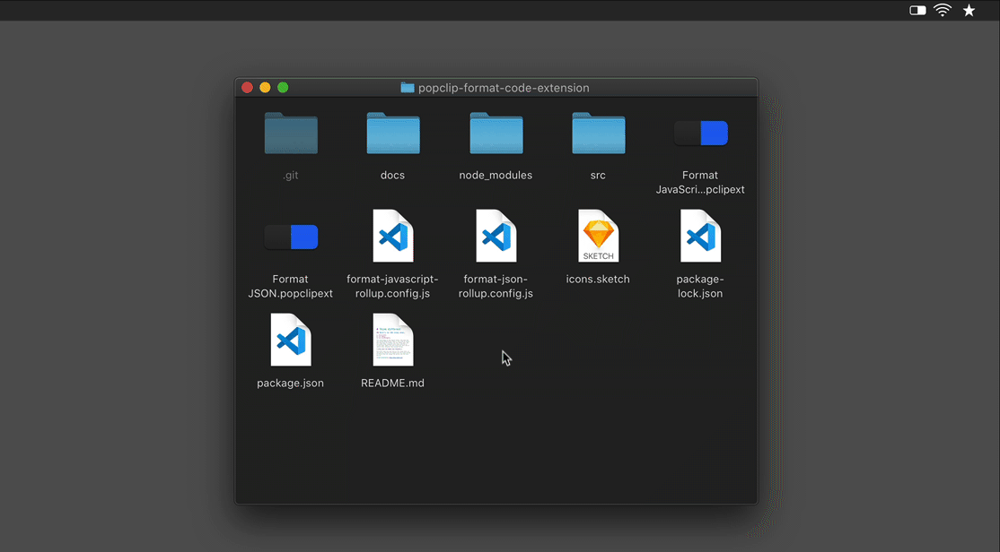
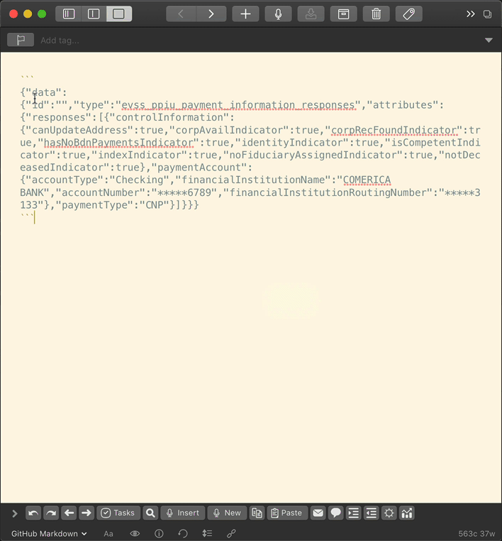

# Format JSON and JavaScript PopClip Extensions

## The Prettier-powered PopClip extensions

These simple [PopClip](http://pilotmoon.com/popclip/) extensions use [Prettier](https://prettier.io) to quickly format JavaScript and JSON.

The following instructions are for the "Format JSON" extension. But the "Format JavaScript" one works the same way.

## Installation

1. Download or clone this repo to your computer.
2. Double-click the `Format JSON.popclipext` extension to install it in PopClip.
3. Click the `Install "Format JSON"` button in the confirmation modal.
4. Confirm that the Format JSON extension is activated.

## Usage

1. Select some poorly formatted, yet valid, JSON.
2. Click the JSON icon (curly braces) in PopClip.
3. The poorly formatted JSON will be replaced with nicely formatted JSON.

## Notes

- If you have a `.prettierrc` file in your home dir, those settings will be used. Otherwise Prettier's [default settings](https://prettier.io/docs/en/options.html) will be used.
