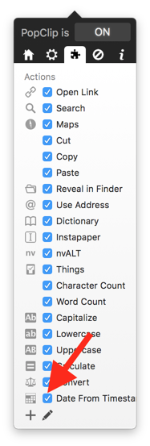

# 'Format JSON' PopClip Extension

This simple [PopClip](http://pilotmoon.com/popclip/) extension quickly converts a JavaScript timestamp (milliseconds since Jan 1 1970) into a human-readable date.

## Installation

1. Download or clone this repo to your computer
2. Double-click the `Format JSON.popclipext` extension to install it in PopClip
3. Confirm that the Format JSON extension is activated:

## Usage

1. Select some valid JSON
2. Click the JSON icon
3. The poorly formatted JSON will be replaced with JSON formatted by Prettier.
